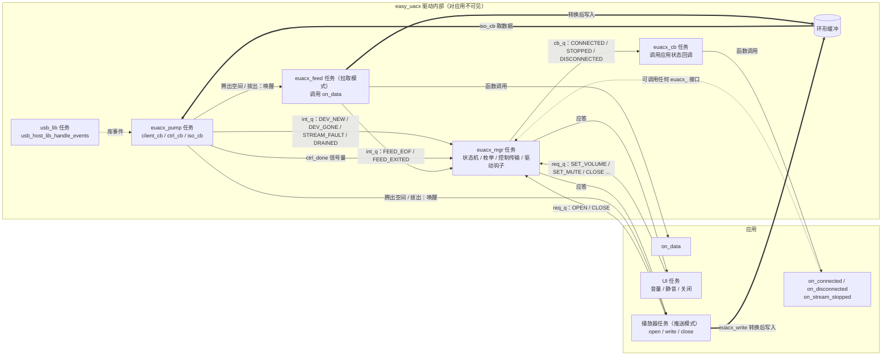
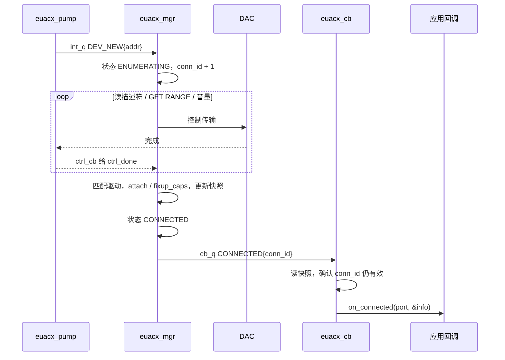
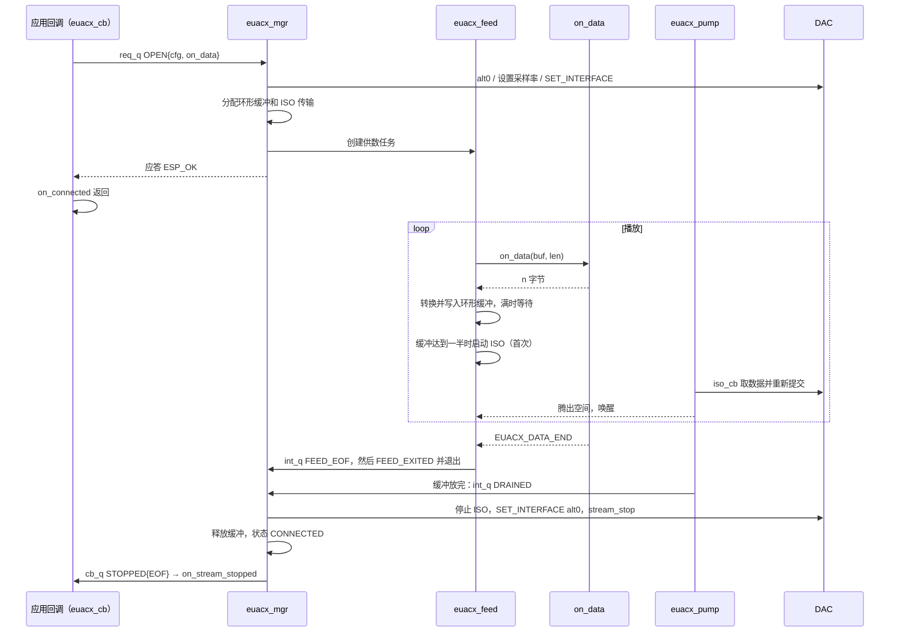
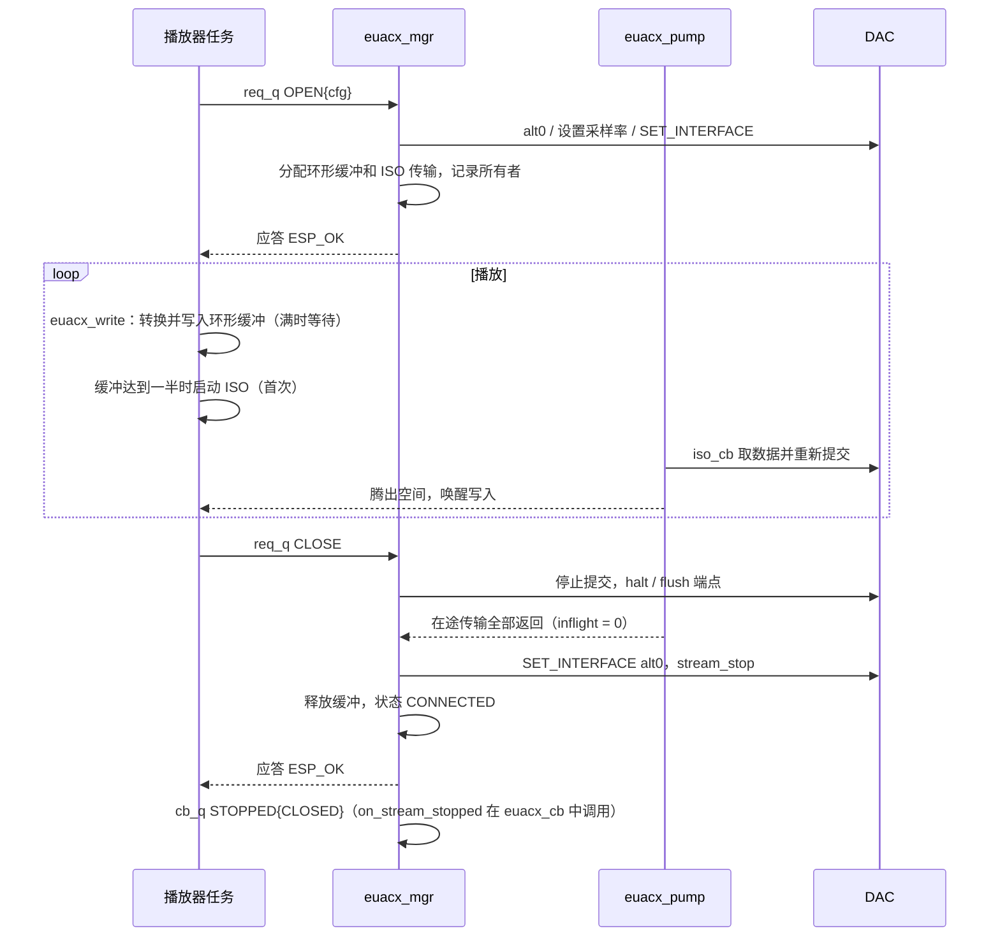
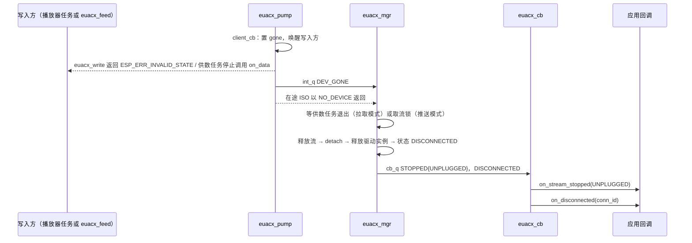

# easy UAC 驱动：简化接口、按 USB ID 创建驱动实例、按能力推送 PCM / DSD

## 1. 目标
- **简化接口、底层完全封装**：应用只包含 `easy_uacx.h`，注册状态回调后，在 `on_connected` 中查看能力、打开流，用推送（`euacx_write`）或拉取（`on_data` 回调）提供数据，随时调节音量；不需要了解 UAC2 描述符、alt、时钟、ISO 传输和 USB Host 任务。
- **按 USB ID 创建驱动实例**：设备枚举时按 VID:PID 在驱动表中匹配驱动（精确匹配 → 厂商通配 → 通用驱动），为该设备创建驱动实例。驱动可以修正描述符能力、执行厂商初始化、提供已实测能力和默认音量。
- **按能力推送 PCM、DSD 或 DoP**：应用根据设备能力选择推送 PCM、原始 DSD 或已编码的 DoP。驱动自动选择 alt 和传输方式：PCM 做位深转换；DSD 优先原生 DSD，其次 DoP；DoP 输入按设备能力透传或还原成原生 DSD；设备不支持时明确返回错误。
- **范围**：单个 USB DAC、立体声播放、ESP32-S3（FS）和 ESP32-P4（HS）。录音、多设备、重采样、DSD 转 PCM 不在本次范围。
- **版本划分**：
  - **1.0**：PCM 16 / 24 / 32 位播放（推送和拉取）、端口与状态回调、驱动实例、热插拔、异步反馈（第 9 节 M1–M3）。DSD / DoP 相关的类型和字段在 1.0 的头文件中就定义好，但 `euacx_info_t.dsd` 始终为空，以 DSD / DoP 格式打开流返回 `ESP_ERR_NOT_SUPPORTED`；这样 2.0 不改接口，应用代码不用改。
  - **2.0**：1.0 发布后，按手头实际的 DSD DAC 适配 DSD 推送、DoP 推送、原生 DSD 和对应驱动（第 9 节 2.0）。本文中标注"（2.0）"的内容都属于此版本，1.0 不实现。

## 2. 现状
- `examples/common/uac2_playback_demo.c`（约 500 行）直接调用 ESP-IDF USB Host API，已在 S3 和 P4 上用 CX31993（`06cb:1594`）实测通过 24 位 44.1 / 48 / 96 / 192 kHz（S3 的 192 kHz 因带宽跳过）。其中控制传输、描述符解析、`SET_INTERFACE`、静音 / 音量、按标称速率的 ISO 发送（累加器处理 44.1 kHz）都是可复用的实测代码。
- 组件 `components/easy-esp-uacx/`：
  - 有实际逻辑并有单元测试：选择器 `uac2_selector.c`、包长 `uac2_packetizer.c`、环形缓冲 `uac2_ring.c`、DoP 打包 `uac2_dop.c`、quirk 表。
  - 占位：13 个文件只有 `// TODO`；`uac2_host.h` 声明的 9 个函数没有实现。
- 上游驱动 `uac2_host/`（Averyy/esp-uac2-host @ a072adb，MIT）目前原样内置。它按 FS 1 ms 节拍计算包长，HS 下 `bInterval = 1` 的端点数据速率不正确；非整数采样率要求反馈端点。因此本驱动的 USB 层不基于上游实现，上游副本将完全删除（第 6.1 节）。
- `examples/player/` 已删除；`.gitmodules` 只剩 `third_party/esp-usb`。

## 3. 公开接口（`include/easy_uacx.h`）
统一使用 `euacx_` 前缀。底层完全封装：公开头文件只依赖 `esp_err.h` 和 C 标准头文件，不出现 USB Host 类型、描述符、alt、驱动表或任务句柄；应用通过**函数回调**得知 DAC 的接入、拔出和流的结束，通过**同步查询函数**读取状态和能力，通过**播放接口**（推送或拉取两种方式）播放，通过**音量接口**调节音量。DSD / DoP 相关的类型和字段从 1.0 起就在头文件中，1.0 中不可用（见第 1 节"版本划分"）。

```c
typedef struct euacx_port euacx_port_t;              /* one per USB root port, valid until euacx_deinit */

typedef enum {
    EUACX_STATE_DISCONNECTED,
    EUACX_STATE_ENUMERATING,
    EUACX_STATE_CONNECTED,       /* driver instance ready, no stream */
    EUACX_STATE_STREAMING,
} euacx_state_t;

typedef enum { EUACX_SPEED_FS, EUACX_SPEED_HS } euacx_speed_t;
typedef enum { EUACX_FORMAT_PCM, EUACX_FORMAT_DSD, EUACX_FORMAT_DOP } euacx_format_t;  /* what the app provides */
typedef enum { EUACX_MODE_PCM, EUACX_MODE_DOP, EUACX_MODE_NATIVE_DSD } euacx_mode_t;  /* what goes on the wire */
typedef enum { EUACX_DSD64 = 64, EUACX_DSD128 = 128, EUACX_DSD256 = 256 } euacx_dsd_rate_t;

typedef enum {
    EUACX_STOP_EOF,              /* pull mode: on_data returned EUACX_DATA_END and the buffer has drained */
    EUACX_STOP_CLOSED,           /* euacx_stream_close / euacx_stream_abort */
    EUACX_STOP_UNPLUGGED,
    EUACX_STOP_ERROR,            /* ISO errors exceeded EUACX_MAX_ERRORS */
} euacx_stop_reason_t;

typedef struct {
    uint8_t  num_rates;
    uint32_t rates[EUACX_MAX_RATES];    /* ascending */
} euacx_rate_list_t;

typedef struct {
    uint32_t          conn_id;          /* increments on every attach of this port */
    uint16_t          vid, pid;
    char              product[32];
    const char       *driver;           /* matched driver name, "generic" if none */
    euacx_speed_t     speed;
    bool              verified;         /* capabilities come from the driver's verified table */
    euacx_rate_list_t pcm[3];           /* index 0/1/2 = 16/24/32-bit input */
    euacx_rate_list_t dsd;              /* DSD64/128/256 as 64/128/256; accepted for both DSD and DoP input */
    euacx_mode_t      dsd_mode[3];      /* per DSD rate: NATIVE_DSD or DOP */
    bool              has_volume, has_mute;
    int16_t           volume_min, volume_max, volume_res;  /* 1/256 dB */
} euacx_info_t;

/* All run in the driver's callback task, one at a time, in order. Any euacx_ API may be called from them. */
typedef struct {
    void (*on_connected)(euacx_port_t *port, const euacx_info_t *info, void *user);   /* info valid during the call */
    void (*on_disconnected)(euacx_port_t *port, uint32_t conn_id, void *user);
    void (*on_stream_stopped)(euacx_port_t *port, euacx_stop_reason_t reason, esp_err_t err, void *user);
} euacx_callbacks_t;

typedef struct {
    euacx_callbacks_t cb;               /* any member may be NULL */
    void             *user;             /* passed to every callback above */
    bool              install_usb_host; /* true: driver installs the USB Host library and runs its task */
    int               task_priority;    /* euacx_mgr and callback task; pump / lib / feed priorities are Kconfig */
    int               task_core;        /* all driver tasks, -1 = no affinity */
} euacx_config_t;

#define EUACX_CONFIG_DEFAULT() { .cb = { 0 }, .user = NULL, .install_usb_host = true, \
                                 .task_priority = 5, .task_core = -1 }

/* Pull mode: fill up to len bytes in the stream's input format (no frame alignment needed).
 * Return bytes filled, 0 = nothing available yet (driver retries, buffer may underrun), or EUACX_DATA_END. */
#define EUACX_DATA_END (-1)
typedef int (*euacx_data_cb_t)(euacx_port_t *port, void *buf, size_t len, void *user);

typedef struct {
    euacx_format_t   format;
    uint32_t         sample_rate;       /* PCM only; DoP carrier rate is derived from dsd_rate */
    uint8_t          bits;              /* PCM: 16 / 24 / 32; DoP: 24 (packed) or 32 (container) */
    uint8_t          channels;          /* 2 */
    euacx_dsd_rate_t dsd_rate;          /* DSD and DoP */
    euacx_data_cb_t  on_data;           /* NULL = push mode (euacx_write), otherwise pull mode */
    void            *data_user;         /* passed to on_data */
} euacx_stream_config_t;

esp_err_t     euacx_init(const euacx_config_t *cfg);
esp_err_t     euacx_deinit(void);

/* DAC state and capabilities */
int           euacx_port_count(void);
euacx_port_t *euacx_get_port(int index);                            /* 0 = first enabled port, NULL if out of range */
euacx_state_t euacx_get_state(euacx_port_t *port);
esp_err_t     euacx_get_info(euacx_port_t *port, euacx_info_t *out);  /* copied out */

/* playback */
esp_err_t euacx_stream_open(euacx_port_t *port, const euacx_stream_config_t *cfg, euacx_mode_t *mode);  /* mode may be NULL */
esp_err_t euacx_write(euacx_port_t *port, const void *data, size_t len, size_t *written, uint32_t timeout_ms);  /* push only */
esp_err_t euacx_stream_close(euacx_port_t *port);
esp_err_t euacx_stream_abort(euacx_port_t *port);                    /* never blocks */

/* volume */
esp_err_t euacx_set_volume(euacx_port_t *port, int16_t db256);     /* clamped and snapped to the device step */
esp_err_t euacx_get_volume(euacx_port_t *port, int16_t *db256);
esp_err_t euacx_set_mute(euacx_port_t *port, bool mute);
esp_err_t euacx_get_mute(euacx_port_t *port, bool *mute);
```

接口按用途分为四组：

| 用途 | 接口 | 说明 |
|---|---|---|
| 状态通知 | `on_connected`、`on_disconnected`、`on_stream_stopped` | 在 `euacx_init` 时通过 `euacx_config_t.cb` 注册，驱动在自己的回调任务中调用 |
| 状态与能力查询 | `euacx_get_state`、`euacx_get_info` | 任意时刻同步查询，读驱动维护的快照 |
| 播放 | `euacx_stream_open` / `euacx_write` / `euacx_stream_close` / `euacx_stream_abort` | 推送：应用任务调用 `euacx_write`；拉取：驱动在需要数据时调用 `on_data` |
| 音量 | `euacx_set_volume` / `euacx_get_volume` / `euacx_set_mute` / `euacx_get_mute` | 1/256 dB，按设备范围和步进修正 |

### 3.1 数据格式
推送（`euacx_write`）和拉取（`on_data` 填充的缓冲）使用相同的格式：

| 格式 | 应用提供的数据 |
|---|---|
| PCM 16 位 | 交错、小端 `int16_t`，每帧 2 × 2 字节 |
| PCM 24 位 | 交错、小端、3 字节紧凑排列，每帧 2 × 3 字节 |
| PCM 32 位 | 交错、小端 `int32_t`，每帧 2 × 4 字节 |
| DSD（2.0） | 按字节交错、每字节高位在前（与 DSDIFF / DFF 一致）：`L0 R0 L1 R1 …`，每字节 8 个 DSD 样本。DSF 文件需由应用先转成此格式 |
| DoP 24 位（2.0） | 已按 DoP v1.1 编码的帧，交错、小端、3 字节紧凑：每声道 `[较晚的 DSD 字节, 较早的 DSD 字节, 标记]`，标记逐帧在 `0x05` / `0xFA` 之间交替，同一帧内各声道标记相同 |
| DoP 32 位（2.0） | 同上，放在小端 32 位容器的高 24 位，最低字节为 0：每声道 `[0x00, 较晚, 较早, 标记]`（播放器常见的 S32 DoP 输出） |

DoP 输入适合已经在输出 DoP 的播放器或解码库。DoP 的载波采样率由 `dsd_rate` 决定：DSD64 / 128 / 256 分别为 176.4 / 352.8 / 705.6 kHz，`sample_rate` 字段不使用。

### 3.2 行为约定
- `euacx_stream_open` 只接受 `euacx_info_t` 中列出的组合，否则返回 `ESP_ERR_NOT_SUPPORTED`；不做重采样，也不把 DSD 转成 PCM。通过 `mode` 返回实际传输方式（可传 `NULL`）。
- （2.0）DoP 输入的可用速率与 `euacx_info_t.dsd` 相同：设备该速率走 DoP 时透传（`mode = EUACX_MODE_DOP`），走原生 DSD 时由驱动去掉标记、还原成原生 DSD（`mode = EUACX_MODE_NATIVE_DSD`）。DoP 数据必须逐位透传，驱动不对其做任何数字处理；音量只能用 DAC 的硬件音量。
- （2.0）驱动检查 DoP 输入的标记：标记不是 `0x05` / `0xFA` 或没有交替时计数并打印警告（每秒最多一次），数据仍照常发送，不做修正。
- **推送模式**（`on_data = NULL`）：`euacx_write` 阻塞直到全部写入或超时；设备拔出后立即返回 `ESP_ERR_INVALID_STATE`。写入数量不必按帧对齐，驱动内部保存不完整的帧。超时返回 `ESP_ERR_TIMEOUT`，已写入的字节数通过 `written` 返回（可为 `NULL`）。`euacx_write` 返回时数据已拷入驱动缓冲，`data` 可立即复用。
- **拉取模式**（`on_data != NULL`）：`euacx_stream_open` 返回后，驱动的供数任务 `euacx_feed` 在缓冲有空间时调用 `on_data`，把返回的数据转换后写入缓冲。
  - 返回 `> 0`：已填充的字节数，可以少于 `len`，不必按帧对齐。
  - 返回 `0`：暂时没有数据，驱动等待 Kconfig `EUACX_FEED_RETRY_MS`（默认 2 ms）后再调用；期间缓冲耗尽会按欠载规则补静音。
  - 返回 `EUACX_DATA_END`：不再调用 `on_data`；缓冲中的数据播放完后驱动自动关闭流，回调 `on_stream_stopped(EUACX_STOP_EOF)`。
  - 拉取模式下调用 `euacx_write` 返回 `ESP_ERR_INVALID_STATE`。
- 流打开后，缓冲区达到一半时才开始 ISO 传输，避免开头欠载；欠载时 PCM 补 0；（2.0）DoP / 原生 DSD 补 DSD 静音码 `0x69`，避免 DAC 退出 DSD 模式产生爆音，DoP 补静音时标记接着最后一帧继续交替（驱动从输入中跟踪标记相位）。
- 每次成功的 `euacx_stream_open` 都恰好对应一次 `on_stream_stopped`，原因见 `euacx_stop_reason_t`；`err` 只在 `EUACX_STOP_ERROR` 时有意义。
- 音量：`euacx_info_t.has_volume` 为 `false` 时音量接口返回 `ESP_ERR_NOT_SUPPORTED`；设置值超出 `volume_min` / `volume_max` 时截断，并按 `volume_res` 对齐；`euacx_get_volume` 返回 DAC 实际读回的值。接入时驱动不改变 DAC 的初始音量（驱动条目指定了默认音量的除外，见第 4.2 节）。
- 每个端口只支持一个 DAC；同一端口（含其下的 Hub）上第二个 UAC2 设备接入时打印警告并忽略。

### 3.3 端口与状态
应用拿到的句柄对应一个 USB 根端口，而不是某一台设备：

- **创建与释放**：`euacx_init` 为每个启用的根端口创建一个 `euacx_port_t`，`euacx_deinit` 时释放；期间句柄始终有效，可以随意保存、在任务之间传递，不会悬空，也不会被新设备"顶替"。
- **端口范围**：ESP32-S3 为唯一的 OTG 口；ESP32-P4 默认为 HS 口，Kconfig `EUACX_PORT_P4_FS` 可再启用 FS 口。`euacx_port_count()` 返回启用的端口数，`euacx_get_port(i)` 按序取句柄。
- **驱动实例挂在端口下**：设备接入时按 USB ID 创建驱动实例（内部类型 `euacx_dev_t`，见第 4 节），拔出时销毁；应用只接触端口句柄。
- **连接序号 `conn_id`**：端口每接入一次设备加 1，出现在 `on_connected` 的 `info`、`on_disconnected` 的参数和 `euacx_get_info` 的结果中。应用在其他任务中处理时，用它判断操作是否仍属于当前这次接入。

状态机：

```
DISCONNECTED → ENUMERATING → CONNECTED ⇄ STREAMING
      ↑_________ 拔出（任何状态）_________|
```

- `ENUMERATING` 期间读取描述符、匹配驱动、读取能力；失败时打印原因并回到 `DISCONNECTED`，不调用 `on_connected`。
- `STREAMING` 中 ISO 连续出错、拉取模式播放结束、或流被关闭时，驱动停止流，状态回到 `CONNECTED`，回调 `on_stream_stopped`。
- 拔出时，驱动停止 ISO 传输、释放流和驱动实例，状态改为 `DISCONNECTED`，依次回调 `on_stream_stopped(EUACX_STOP_UNPLUGGED)`（如果正在播放）和 `on_disconnected`。

各接口在不同状态下的行为：

| 接口 | DISCONNECTED / ENUMERATING | CONNECTED | STREAMING |
|---|---|---|---|
| `euacx_get_state` | 返回状态 | 返回状态 | 返回状态 |
| `euacx_get_info` | `ESP_ERR_INVALID_STATE` | 复制信息 | 复制信息 |
| `euacx_stream_open` | `ESP_ERR_INVALID_STATE` | 打开，进入 `STREAMING` | `ESP_ERR_INVALID_STATE` |
| `euacx_write` | `ESP_ERR_INVALID_STATE` | `ESP_ERR_INVALID_STATE` | 推送模式：写入；拉取模式：`ESP_ERR_INVALID_STATE` |
| `euacx_stream_close` | `ESP_OK`（流已由驱动释放） | `ESP_OK` | 关闭，回到 `CONNECTED` |
| `euacx_stream_abort` | `ESP_OK`（无操作） | `ESP_OK`（无操作） | 推送模式：置中止标志并唤醒写入，状态仍为 `STREAMING`；拉取模式：异步关闭流 |
| 音量 / 静音 | `ESP_ERR_INVALID_STATE` | 可用 | 可用 |

`euacx_stream_close` 在任何状态下都可以安全调用，应用结束播放时总是调用它即可，不需要区分是否已经拔出。

### 3.4 回调与线程规则
**回调在哪里运行**：

| 回调 | 运行任务 | 能做什么 | 不能做什么 |
|---|---|---|---|
| `on_connected` / `on_disconnected` / `on_stream_stopped` | 驱动的回调任务 `euacx_cb`（优先级 `task_priority`，栈 Kconfig `EUACX_CB_STACK`，默认 4096） | 调用任何 `euacx_` 接口：查询能力、打开拉取模式的流、设置音量、关闭流；把 `port` / `conn_id` 转给应用自己的任务 | 长时间阻塞（会推迟后续回调，包括其他端口的回调）；在回调中以推送模式打开流并循环写入 |
| `on_data` | 每个拉取模式流一个供数任务 `euacx_feed`（Kconfig `EUACX_FEED_PRIORITY` 默认 10、`EUACX_FEED_STACK` 默认 8192） | 解码、读文件；可以短时间阻塞；可以调用音量接口 | 对同一端口调用 `euacx_stream_open` / `euacx_stream_close`（返回 `ESP_ERR_INVALID_STATE`），要结束时返回 `EUACX_DATA_END` |

- **顺序和配对**：三个状态回调由同一个任务按发生顺序逐个调用，不会并发。驱动保证配对：
  - 只有调用过 `on_connected` 的那次接入，才会有对应的 `on_disconnected`；
  - 回调任务执行 `on_connected` 前再次读取快照，若该次接入已经被拔出（`conn_id` 不一致或状态为 `DISCONNECTED`），则 `on_connected` 和对应的 `on_disconnected` 都不调用；
  - 每次成功打开的流恰好有一次 `on_stream_stopped`，并且在同一次接入的 `on_disconnected` 之前。
- **回调中的数据**：`on_connected` 的 `info` 指针只在回调期间有效，需要保留时复制一份 `euacx_info_t`（只含值和指向常量字符串的 `driver`，可以按值复制）。
- **回调要尽快返回**：建议在 100 ms 以内。回调队列（Kconfig `EUACX_CB_QUEUE_LEN`，默认 16）满时，驱动丢弃新的通知并打印错误，但 `on_disconnected` / `on_stream_stopped` 预留位置，不会被丢弃。
- **拉取模式的供数任务**：驱动缓冲默认 `EUACX_BUFFER_MS`（40 ms）。`on_data` 中读 SD 卡或网络有较大抖动时，调大该值或在应用侧加缓冲。`EUACX_FEED_STACK` 要按解码器需要调大（FLAC / MP3 解码器通常需要 8–16 KB）。
- **推送模式的流所有者**：`euacx_stream_open` 成功时记录调用任务。推送模式下 `euacx_write` / `euacx_stream_close` 只能由该任务调用，其他任务调用返回 `ESP_ERR_INVALID_STATE` 并打印警告，不影响正在进行的播放。其他任务要停止播放时调用 `euacx_stream_abort`：
  - 驱动置位中止标志并唤醒阻塞中的 `euacx_write`，该调用及之后的写入都返回 `ESP_ERR_INVALID_STATE`，直到所有者调用 `euacx_stream_close`；
  - `abort` 不释放流也不停止 ISO，缓冲区放完后按欠载规则补静音，资源由所有者的 `close` 统一释放；
  - 所有者可用 `euacx_get_state` 区分写入失败的原因：仍为 `STREAMING` 表示被中止，`DISCONNECTED` 表示拔出，`CONNECTED` 表示流出错。
- **拉取模式没有所有者**：除 `on_data` 所在的供数任务外，任何任务（包括回调任务）都可以调用 `euacx_stream_close`；`euacx_stream_abort` 不阻塞，适合在不能等待的地方调用。
- **其他接口**：`euacx_get_port`、`euacx_get_state`、`euacx_get_info`、音量 / 静音可以在任意任务中调用（中断中不能调用）。打开 / 关闭流和音量会以请求消息交给驱动内部的 `euacx_mgr` 任务执行，调用者阻塞等待应答；`euacx_write`、`euacx_stream_abort`、`euacx_get_state` / `euacx_get_info` 不经过消息，开销与普通函数调用相当（第 5.5 节）。
- **优先级**：应用中调用 `euacx_write` 的任务和 `EUACX_FEED_PRIORITY` 都要低于 `euacx_pump`（默认 19），否则持续解码时会推迟 ISO 补数据。
- 格式相同的曲目保持流打开，连续提供数据可实现无缝播放；格式变化时先关闭再打开。

### 3.5 应用示例
**拉取模式**，全部逻辑写在回调里，最简单：

```c
static int on_data(euacx_port_t *port, void *buf, size_t len, void *user)
{
    return decoder_read(buf, len);                 /* bytes, 0 = not ready yet, EUACX_DATA_END = finished */
}

static void on_connected(euacx_port_t *port, const euacx_info_t *info, void *user)
{
    ESP_LOGI(TAG, "%04x:%04x %s (driver %s)", info->vid, info->pid, info->product, info->driver);
    if (info->has_mute) euacx_set_mute(port, false);

    euacx_stream_config_t req = { .format = EUACX_FORMAT_PCM, .sample_rate = 48000, .bits = 24, .channels = 2,
                                  .on_data = on_data };
    if (euacx_stream_open(port, &req, NULL) != ESP_OK) ESP_LOGW(TAG, "48 kHz / 24-bit not supported");
}

static void on_stream_stopped(euacx_port_t *port, euacx_stop_reason_t reason, esp_err_t err, void *user)
{
    ESP_LOGI(TAG, "stream stopped, reason %d", reason);
}

static void on_disconnected(euacx_port_t *port, uint32_t conn_id, void *user)
{
    ESP_LOGI(TAG, "DAC removed");
}

void app_main(void)
{
    euacx_config_t cfg = EUACX_CONFIG_DEFAULT();
    cfg.cb.on_connected      = on_connected;
    cfg.cb.on_disconnected   = on_disconnected;
    cfg.cb.on_stream_stopped = on_stream_stopped;
    ESP_ERROR_CHECK(euacx_init(&cfg));
}

/* UI, any task */
void on_volume_knob(int16_t db256) { euacx_set_volume(euacx_get_port(0), db256); }
void on_stop_button(void)          { euacx_stream_close(euacx_get_port(0)); }
```

**推送模式**，回调只转发，播放器任务独占流（已有播放器框架、自己控制解码节奏时使用）：

```c
typedef struct { euacx_port_t *port; uint32_t conn_id; } dac_ready_t;
static QueueHandle_t s_dac_q;                      /* xQueueCreate(2, sizeof(dac_ready_t)) */

static void on_connected(euacx_port_t *port, const euacx_info_t *info, void *user)
{
    dac_ready_t r = { port, info->conn_id };
    xQueueSend(s_dac_q, &r, 0);                    /* hand off; return quickly */
}

static void player_task(void *arg)                 /* stream owner */
{
    dac_ready_t r;
    for (;;) {
        xQueueReceive(s_dac_q, &r, portMAX_DELAY);
        euacx_info_t info;
        if (euacx_get_info(r.port, &info) != ESP_OK || info.conn_id != r.conn_id) continue;  /* already gone */

        euacx_stream_config_t req = { .format = EUACX_FORMAT_PCM, .sample_rate = 48000, .bits = 24, .channels = 2 };
        if (euacx_stream_open(r.port, &req, NULL) != ESP_OK) continue;

        size_t len;
        while (decode_next(buf, &len)) {
            if (euacx_write(r.port, buf, len, NULL, portMAX_DELAY) != ESP_OK) break;  /* unplug / abort / error */
        }
        euacx_stream_close(r.port);                /* safe even if the DAC was unplugged */
    }
}

/* UI, any task */
void on_stop_button(void) { euacx_stream_abort(euacx_get_port(0)); }   /* wakes the player's euacx_write */
```

## 4. 驱动实例：按 USB ID 匹配
### 4.1 驱动描述
```c
typedef struct {
    uint8_t         bits, subslot;
    euacx_rate_list_t rates;            /* verified on hardware */
} euacx_verified_pcm_t;

typedef struct {
    const euacx_verified_pcm_t *fs, *hs;     /* per speed, NULL = not verified */
    uint8_t num_fs, num_hs;
    bool    has_volume;
    int16_t volume_db256;                   /* applied on attach */
    const char *verified;                   /* date / boards / IDF version */
} euacx_verified_caps_t;

typedef struct euacx_driver {
    const char *name;
    uint16_t    vid, pid;                   /* pid 0 = any product of this vendor */
    uint32_t    flags;                      /* EUACX_DRV_NATIVE_DSD, EUACX_DRV_VENDOR_INIT, ... */
    const euacx_verified_caps_t *verified;   /* NULL = descriptors only */
    esp_err_t (*attach)(euacx_dev_t *dev, void **ctx);
    void      (*detach)(euacx_dev_t *dev, void *ctx);
    esp_err_t (*fixup_caps)(euacx_dev_t *dev, void *ctx, euacx_dev_caps_t *caps);
    esp_err_t (*stream_start)(euacx_dev_t *dev, void *ctx, const euacx_stream_state_t *s);
    esp_err_t (*stream_stop)(euacx_dev_t *dev, void *ctx);
} euacx_driver_t;
```
钩子都可以为 `NULL`，只在 `euacx_mgr` 任务中同步调用，可以执行控制传输，但不能调用公开接口（第 5.5.3 节）。能用数据表达的（已实测能力、默认音量、标志位）写在条目里，不写钩子。驱动描述放在私有头文件 `private/euacx_driver.h`，应用不直接接触。

### 4.2 枚举流程
以下步骤都在 `euacx_mgr` 任务中执行（时序见第 5.5.5 节）：
1. `euacx_pump` 的 `client_cb` 投递 `DEV_NEW` → `euacx_mgr` 打开设备，读取设备描述符和配置描述符。
2. 确认存在 UAC2 播放接口（Audio Class、AudioStreaming、协议 0x20、OUT 等时端点），否则忽略该设备。
3. 按 VID:PID 在驱动表中匹配：精确匹配 → 同厂商通配（`pid = 0`）→ 通用驱动 `generic`。
4. 端口状态改为 `ENUMERATING`，`conn_id` 加 1；在端口下创建驱动实例 `euacx_dev_t`（保存驱动指针、驱动私有上下文、设备能力、USB 设备句柄），调用 `attach`。`euacx_dev_t` 只在驱动内部和驱动回调中使用，不出现在公开头文件中。
5. 解析描述符得到设备能力（第 5.1 节），调用 `fixup_caps` 修正。
6. 若驱动带已实测能力，且 Kconfig `EUACX_USE_VERIFIED_CAPS` 为 `y`（默认），`euacx_info_t` 只列出已实测组合，`verified = true`；描述符里有、表里没有的组合只打印日志。表中组合在描述符中找不到对应 alt 时打印 `VERIFIED MISMATCH` 并忽略该组合。
7. 解除静音；驱动带默认音量时设置该音量，否则保持 DAC 初始音量。
8. 端口状态改为 `CONNECTED`，投递通知，由回调任务调用 `on_connected`。
9. 拔出时：停止流并唤醒阻塞中的 `euacx_write` / 供数任务 → `detach` → 释放驱动实例 → 端口状态改为 `DISCONNECTED` → 回调 `on_stream_stopped(EUACX_STOP_UNPLUGGED)`（如果正在播放）和 `on_disconnected`。端口句柄保留，等待下一次接入。

### 4.3 首批驱动
| 驱动 | 匹配 | 内容 |
|---|---|---|
| `generic` | 其他所有 UAC2 设备 | 只用描述符能力 |
| `cx31993` | `06cb:1594` | 已实测能力：FS 24 位 44.1 / 48 / 96 kHz；HS 24 位 44.1 / 48 / 96 / 192 kHz；默认音量 −10.5 dB。16 / 32 位在 M2 实测后补入 |

`0572:1B08`、`0572:1B09`（CX31993 其他 ID）没有实测，暂不加入。DSD 设备的驱动（如 XMOS `20b1:*`，标记 `EUACX_DRV_NATIVE_DSD`、`fixup_caps` 把 RAW_DATA alt 标为原生 DSD）在 2.0 按实际适配的 DAC 新增，1.0 不包含 `xmos` 驱动。新增设备只需新建 `drivers/drv_<name>.c` 并在驱动表中加一行，用 Kconfig 开关控制是否编译。

## 5. 能力与流
### 5.1 描述符能力
解析逻辑从测试程序的 `parse_cfg()` 移植并扩展：
- 每个立体声播放 alt：接口号、alt 号、端点地址、MPS（含高带宽倍数）、bInterval、subslot、位深、格式（PCM / RAW_DATA）、同步类型、反馈端点地址、终端 ID。
- 时钟源：从 USB Streaming 输入终端的 `bCSourceID` 找到实际时钟实体；遇到时钟选择器或倍频器时打印警告并退回第一个时钟源。
- 采样率：对时钟源发 `GET RANGE` 读取全部子范围，离散值直接加入，连续范围从标准采样率（8000 到 768000 Hz 共 16 个）中挑选；不支持 `GET RANGE` 时用标准列表，打开流时由 `SET_CUR` / `GET_CUR` 读回过滤。
- Feature Unit：沿播放终端通路找到对应的 Feature Unit，记录静音 / 音量控制，读取音量 `GET RANGE` 和初始值。

`euacx_info_t` 中的 PCM / DSD 列表由以上能力和带宽计算得出：
- PCM 每个位深的采样率 = 存在不低于该位深的 PCM alt，且 MPS 能承载该采样率。
- DSD（2.0；1.0 中列表为空）：原生 DSD 需驱动标记 `EUACX_DRV_NATIVE_DSD` 且存在 RAW_DATA alt，载波速率 = DSD 速率 × 44100 / 32；DoP 需要 24 位 PCM alt 能承载 DSD 速率 × 44100 / 16（DSD64 为 176.4 kHz）。同一 DSD 速率两者都可时选原生。

### 5.2 打开流
1. 选择器 `euacx_select()`（由现有 `uac2_find_best_mode` 改造）：PCM 优先位深完全相同的 alt，其次能容纳输入的最小位深 alt；（2.0）DSD 按上面规则选择原生或 DoP。
2. alt0 → 设置采样率并读回 → 时钟有效性检查（如支持）→ claim 并 `SET_INTERFACE` 到播放 alt → 驱动 `stream_start`。顺序沿用测试程序实测通过的做法。
3. 分配环形缓冲（Kconfig `EUACX_BUFFER_MS`，默认 40 ms）和 ISO 传输。

### 5.3 写入与转换
推送模式在调用 `euacx_write` 的任务中、拉取模式在 `euacx_feed` 任务中，把数据转换成设备格式后写入环形缓冲，ISO 回调只做拷贝：

| 输入 → 设备 | 转换 |
|---|---|
| PCM N 位 → 同位深 alt | 直接拷贝（24 位 → 4 字节 subslot 时低字节补 0） |
| PCM 16 位 → 24 / 32 位 alt | 左移补 0 |
| PCM 24 位 → 32 位 alt | 左移 8 位 |

以下转换属于 2.0：

| 输入 → 设备 | 转换 |
|---|---|
| DSD → DoP | 每声道每 2 个 DSD 字节打包成 24 位：最高字节为标记 `0x05` / `0xFA` 交替，其后依次为时间上较早和较晚的 DSD 字节 |
| DSD → 原生 DSD | 每声道每 4 个 DSD 字节组成一个 32 位样本，字节序由驱动指定（XMOS 等不同厂商不同） |
| DoP 24 位 → DoP（3 字节 alt） | 直接拷贝 |
| DoP 24 位 → DoP（4 字节 alt） | 每样本前补一个 0 字节（放到高 24 位） |
| DoP 32 位 → DoP（3 字节 alt） | 丢掉每样本的最低字节 |
| DoP 32 位 → DoP（4 字节 alt） | 直接拷贝 |
| DoP → 原生 DSD | 去掉标记，每帧取出每声道的 2 个 DSD 字节（先较早、后较晚），按 DSD 输入的规则组成原生 DSD 样本 |

1.0 中现有的 `uac2_dop.c` / `uac2_native_dsd.c` 及其单元测试原样保留，不接入流程。2.0 时：现有 `uac2_dop_pack()` 的输入是"每声道 2 字节交错"，需改为第 3.1 节的"按字节交错"输入，并同步修改单元测试；新增 `euacx_dop_unpack()`（DoP → DSD 字节流）和 `euacx_dop_check()`（标记检查、跟踪标记相位），DoP 输入的各种转换都由这三个函数组合完成。

### 5.4 ISO 引擎
从测试程序的 `fill_xfer()` / `iso_cb()` 移植：
- 每秒包数按速度和 bInterval 计算（FS 1000，HS 8000 / 2^(bInterval−1)）；用累加器决定每包帧数，44.1 kHz 系列不需要反馈端点。
- 每次传输的包数：FS 8，HS 32；在途传输数由 Kconfig `EUACX_NUM_TRANSFERS`（默认 4）设置。
- 回调从环形缓冲取数据，欠载时按第 3.2 节补静音并计数；连续错误超过 Kconfig `EUACX_MAX_ERRORS` 时停止重新提交，投递 `STREAM_FAULT` 消息，由 `euacx_mgr` 停止流并回调 `on_stream_stopped(EUACX_STOP_ERROR)`。拉取模式播放结束后缓冲放空时投递 `DRAINED`。
- `iso_cb` 运行在 `euacx_pump` 任务中（USB Host 在 `usb_host_client_handle_events()` 里调用传输回调），不能阻塞，不取锁，不调用应用代码。
- 异步反馈端点在 M3 支持；之前按标称速率发送，异步型 DAC 长时间播放可能有时钟漂移。

### 5.5 任务模型与消息总线
底层完全封装在驱动内部：应用只看到第 3 节的接口和三个状态回调、一个数据回调；USB Host 回调、任务、队列、锁都不对外。

ESP-IDF 的 USB Host 中，控制传输和 ISO 传输的完成回调都在调用 `usb_host_client_handle_events()` 的任务里执行。因此"泵"客户端事件的任务不能自己等待控制传输完成，否则回调永远不会运行、形成死锁；ISO 回调也会因为该任务阻塞而停止补数据。测试程序已经按这个原则拆成两个任务（`client_task` 只泵事件，主任务做枚举和控制传输），驱动沿用这一结构；驱动内部任务之间统一用消息交互，对应用则通过专门的回调任务调用应用回调，应用回调无论做什么都不会卡住 USB 处理。

#### 5.5.1 任务
| 任务 | 创建时机 | 优先级（默认） | 职责 | 能否阻塞 |
|---|---|---|---|---|
| `usb_lib` | `euacx_init`（`install_usb_host = true` 时） | Kconfig `EUACX_LIB_PRIORITY`（20） | `usb_host_lib_handle_events()` | 只阻塞在库事件上 |
| `euacx_pump` | `euacx_init` | Kconfig `EUACX_PUMP_PRIORITY`（19） | 只调用 `usb_host_client_handle_events()`；其中运行 `client_cb`、`ctrl_cb`、`iso_cb` 三个 USB 回调 | 不能，回调里只投递消息、给信号量、补 ISO 数据 |
| `euacx_mgr` | `euacx_init` | `euacx_config_t.task_priority`（5） | 内部消息的唯一消费者：端口状态机、枚举、描述符解析、控制传输、驱动钩子、流的打开 / 关闭、生成应用通知 | 可以，等待控制传输、ISO 排空 |
| `euacx_cb` | `euacx_init` | `euacx_config_t.task_priority`（5） | 逐个调用应用的 `on_connected` / `on_disconnected` / `on_stream_stopped` | 由应用回调决定，只影响后续回调 |
| `euacx_feed` | 拉取模式 `euacx_stream_open` 时创建，流结束时自行退出 | Kconfig `EUACX_FEED_PRIORITY`（10） | 缓冲有空间时调用应用的 `on_data`，转换后写入环形缓冲 | 由 `on_data` 决定，阻塞过久会欠载 |
| 应用任务（UI、播放器） | 应用 | 低于 `euacx_pump` | 调用公开接口 | 可以 |

`euacx_mgr` 是端口状态、驱动实例和流资源的唯一修改者（单写者），不需要"每端口一把互斥锁保护一切"。

#### 5.5.2 交互总图


图中实线是驱动内部的消息和信号量，虚线是 USB 库内部的通道或应用回调中的调用，粗线是音频数据路径。

#### 5.5.3 内部消息
`euacx_mgr` 用队列集（`QueueSet`）同时等待两个队列，每次先取完 `int_q` 再取 `req_q`，保证拔出等内部事件优先于应用请求。第三个队列 `cb_q` 由 `euacx_mgr` 生产、`euacx_cb` 消费：

| 队列 | 生产者 → 消费者 | 消息 | 方式 |
|---|---|---|---|
| `int_q`（Kconfig `EUACX_INT_QUEUE_LEN`，默认 8） | `euacx_pump`、`euacx_feed` → `euacx_mgr` | `DEV_NEW{addr}`、`DEV_GONE{dev_hdl}`、`STREAM_FAULT{port, err}`、`DRAINED{port}`、`FEED_EOF{port}`、`FEED_EXITED{port}` | 单向，超时 0 投递 |
| `req_q`（Kconfig `EUACX_REQ_QUEUE_LEN`，默认 8） | 公开接口 → `euacx_mgr` | `OPEN{cfg}`、`CLOSE`、`SET_VOLUME`、`GET_VOLUME`、`SET_MUTE`、`GET_MUTE`、`DEINIT` | 请求 - 应答 |
| `cb_q`（Kconfig `EUACX_CB_QUEUE_LEN`，默认 16） | `euacx_mgr` → `euacx_cb` | `CONNECTED{port, conn_id}`、`STOPPED{port, conn_id, reason, err}`、`DISCONNECTED{port, conn_id}` | 单向，超时 0 投递 |

```c
typedef struct {
    euacx_msg_id_t    id;
    euacx_port_t     *port;
    union { euacx_stream_config_t open; int16_t db256; bool mute; uint8_t addr; usb_device_handle_t dev; esp_err_t err; } arg;
    void             *out;      /* euacx_mode_t * / int16_t * / bool *, request only */
    esp_err_t        *result;   /* request only */
    SemaphoreHandle_t done;     /* binary, created static on the caller's stack; NULL for one-way messages */
} euacx_msg_t;                  /* private: never appears in easy_uacx.h */
```

规则：
- **请求 - 应答**：公开接口在调用者栈上建一个静态二值信号量（`xSemaphoreCreateBinaryStatic`，不占堆），投递请求后等待应答。投递使用 Kconfig `EUACX_REQ_TIMEOUT_MS`（默认 2000），超时返回 `ESP_ERR_TIMEOUT`；**一旦投递成功，就无限期等待应答**，因为 `euacx_mgr` 会写调用者栈上的结果，提前返回会导致写入已释放的栈。`euacx_mgr` 保证每个请求都应答（控制传输自带 1000 ms 超时，设备拔出时立即失败）。
- **不经过消息的接口**：`euacx_write`（数据路径，直接写环形缓冲）、`euacx_stream_abort`（必须不阻塞：推送模式直接置标志并唤醒写入，拉取模式投递一条不等待应答的 `CLOSE`）、`euacx_get_state` / `euacx_get_info`（读 `euacx_mgr` 在自旋锁下更新的快照）。
- **推送模式的所有者检查在调用者任务中完成**：`OPEN` 时记录调用任务；`CLOSE` / `write` 先比较当前任务，不是所有者直接返回，不投递消息。拉取模式下检查的是"当前任务不是该流的 `euacx_feed`"。
- **`DEV_GONE` 不能丢**：`client_cb` 收到拔出时，先原子地置位端口的 `gone` 标志并唤醒阻塞中的 `euacx_write` / `euacx_feed`，再投递 `DEV_GONE`；投递失败时打印错误，`euacx_mgr` 每处理一条消息前检查 `gone` 标志作为兜底。
- **`STREAM_FAULT` 只发一次**：`iso_cb` 连续错误超过 `EUACX_MAX_ERRORS` 时停止重新提交传输，置位流的 `faulted` 标志并投递一次，之后不再投递。
- **应用通知不能丢关键项**：`STOPPED` 和 `DISCONNECTED` 除了进 `cb_q`，还记录在端口的待通知标志中；`cb_q` 满导致投递失败时，`euacx_cb` 每次取消息前检查这些标志补发，因此只有 `CONNECTED` 可能因队列满被丢弃（同时打印错误），按配对规则其对应的 `DISCONNECTED` 也不再调用。
- **防止死锁**：`euacx_mgr` 和驱动钩子都不调用公开接口，公开的阻塞接口检测到当前任务是 `euacx_mgr` 时返回 `ESP_ERR_INVALID_STATE`。应用回调运行在 `euacx_cb`，不是 `euacx_mgr`，所以在回调中调用打开、关闭、音量等阻塞接口是安全的。`on_data` 运行在 `euacx_feed`，对同一端口打开 / 关闭流会返回 `ESP_ERR_INVALID_STATE`（关闭需要等供数任务退出，在供数任务中等自己会死锁）。
- **`euacx_mgr` 不等待应用代码**：拉取模式关闭流时，`euacx_mgr` 先停止 ISO、置位供数任务的停止标志并唤醒它，然后继续处理其他消息；供数任务从 `on_data` 返回、看到停止标志后投递 `FEED_EXITED` 并退出，`euacx_mgr` 收到后才释放环形缓冲、应答 `CLOSE`、投递 `STOPPED`。即使 `on_data` 阻塞很久，拔出、其他端口和音量请求也照常处理。

#### 5.5.4 回调与消息的分工
| 位置 | 做法 | 原因 |
|---|---|---|
| 驱动对应用的状态通知 | 函数回调 `on_connected` / `on_disconnected` / `on_stream_stopped`，由 `euacx_cb` 任务调用 | 应用使用最简单；单独的回调任务让应用回调可以调用任何接口，也不会卡住驱动 |
| 拉取模式取数据 | 函数回调 `on_data`，由每个流的 `euacx_feed` 任务调用 | 解码器可以直接写在回调里；在独立任务中运行，不占用 `euacx_pump` |
| USB 客户端事件回调 `client_cb` | 只置标志并投递 `DEV_NEW` / `DEV_GONE`，枚举在 `euacx_mgr` 中进行 | 枚举需要控制传输，在泵任务中等待会死锁 |
| ISO 回调 `iso_cb` | 直接从环形缓冲取数据并重新提交；错误、排空通过 `STREAM_FAULT` / `DRAINED` 上报 | 每秒运行 125–1000 次，必须立即补数据；不能阻塞 |
| 控制传输回调 `ctrl_cb` | 只给 `ctrl_done` 信号量 | USB Host API 只能用回调通知完成 |
| 应用接口操作端口 | 请求消息交给 `euacx_mgr` 执行 | 所有状态修改集中在一个任务，拔出与打开 / 音量的竞争按消息顺序处理 |
| 驱动钩子（`attach` / `detach` / `fixup_caps` / `stream_start` / `stream_stop`） | 静态函数表，只在 `euacx_mgr` 中按固定顺序同步调用 | 需要返回值、要修改能力结构、必须在枚举的特定步骤执行；能用数据表达的（已实测能力、默认音量、标志位、DSD 字节序）写在驱动条目里，不写钩子 |

内部不用 `esp_event`：处理函数本质仍是回调，默认事件循环与 Wi-Fi 等共用、延迟不可控，也不支持请求 - 应答。组件不再依赖 `esp_event`。

#### 5.5.5 时序
接入与枚举：



拉取模式播放（在 `on_connected` 中打开）：



推送模式播放：



播放中拔出：



#### 5.5.6 写入与释放的同步
- `euacx_write` 和 `euacx_feed` 等待缓冲空间时不持有任何锁，等在每端口的信号量上；被 `iso_cb` 腾出空间、`gone`、`abort` 或停止标志唤醒。
- 推送模式下 `euacx_write` 只在"转换并拷贝"期间持有每端口的流锁；`euacx_mgr` 释放环形缓冲前先取得流锁。拉取模式下环形缓冲只有 `euacx_feed` 写入，`euacx_mgr` 在收到 `FEED_EXITED` 后才释放。
- `iso_cb` 不取流锁：环形缓冲为单生产者（写入任务或供数任务）单消费者（`iso_cb`）无锁结构；`euacx_mgr` 只在在途传输全部返回（`inflight = 0`）后才释放缓冲。
- 端口记录流的模式、所有者任务、供数任务和 `abort` / `gone` / `faulted` / `eof` 标志；关闭流和拔出处理都会清除它们。

## 6. 组件文件规划
| 文件 | 状态 | 内容 |
|---|---|---|
| `include/easy_uacx.h` | 新增 | 唯一公开头文件 |
| `include/uac2_types.h`、`include/uac2_caps.h`、`include/uac2_host.h` | 删除 | 类型并入 `easy_uacx.h` 或私有头文件 |
| `private/euacx_internal.h` | 由 `uac2_internal.h` 改写 | 端口、驱动实例、能力、流状态、内部函数 |
| `private/euacx_driver.h` | 新增 | 驱动描述和驱动表接口 |
| `private/uac2_desc.h` | 改写 | UAC2 描述符和请求常量 |
| `core/euacx_manager.c` | 由占位文件改写 | init / deinit、`euacx_mgr` 任务（消息分发、端口状态机、热插拔）、`euacx_pump` / `usb_lib` 任务 |
| `core/euacx_bus.c` | 新增 | `euacx_msg_t`、`int_q` / `req_q` 和队列集、请求 - 应答辅助函数（栈上静态信号量） |
| `core/euacx_callback.c` | 新增 | `euacx_cb` 任务、`cb_q`、待通知标志、回调配对规则 |
| `stream/euacx_feed.c` | 新增 | 拉取模式供数任务 `euacx_feed` |
| `core/euacx_parser.c` | 由占位文件改写 | 描述符解析（移植 `parse_cfg()` 并扩展） |
| `core/euacx_control.c` | 由占位文件改写 | 控制传输、`SET_INTERFACE`、采样率、静音 / 音量、`GET RANGE` |
| `core/euacx_selector.c` | 由 `uac2_selector.c` 改名 | 能力汇总和模式选择 |
| `core/uac2_device.c`、`core/uac2_clock.c` | 删除 | 并入 manager / control |
| `stream/euacx_stream.c` | 由占位文件改写 | 流打开 / 关闭、`euacx_write`、格式转换调度 |
| `stream/euacx_iso.c` | 由占位文件改写 | ISO 引擎（移植 `fill_xfer()` / `iso_cb()`） |
| `stream/euacx_feedback.c` | M3 实现 | 异步反馈 |
| `stream/euacx_ring.c`、`stream/euacx_packetizer.c` | 改名 | 环形缓冲、包长计算 |
| `format/euacx_pcm.c` | 改写 | PCM 位深转换 |
| `format/euacx_dop.c`、`format/euacx_native_dsd.c` | 2.0 改写（1.0 保留现有 `uac2_dop.c` / `uac2_native_dsd.c`，不接入流程） | DoP 和原生 DSD 打包 |
| `drivers/euacx_drivers.c` | 由 `quirk_table.c` 改写 | 驱动表与匹配 |
| `drivers/drv_generic.c`、`drv_cx31993.c` | 由 quirk 文件改写 | 各驱动 |
| `quirks/quirk_xmos.c` | 1.0 删除 | 2.0 按实际适配的 DAC 新建 `drivers/drv_<name>.c` |
| `uac2_host/`（整个目录） | 删除 | 上游 esp-uac2-host 副本，见第 6.1 节 |
| `quirks/quirk_cmedia.c` | 删除 | 没有设备和需求 |
| `port/euacx_os.c`、`port/euacx_mem.c` | 改写 / 改名 | 任务、锁、内存分配封装 |
| `port/uac2_usb_esp.c` | 删除 | 由 control / iso 直接使用 ESP-IDF USB Host API |
| `test/test_easy_uacx.c` | 由 `test_uac2_host.c` 改写 | 单元测试 |

- `Kconfig`：`EUACX_DRV_CX31993`、`EUACX_USE_VERIFIED_CAPS`、`EUACX_BUFFER_MS`、`EUACX_NUM_TRANSFERS`、`EUACX_MAX_ERRORS`、`EUACX_TASK_STACK`、`EUACX_LIB_PRIORITY`、`EUACX_PUMP_PRIORITY`、`EUACX_PUMP_STACK`、`EUACX_INT_QUEUE_LEN`、`EUACX_REQ_QUEUE_LEN`、`EUACX_REQ_TIMEOUT_MS`、`EUACX_CB_STACK`、`EUACX_CB_QUEUE_LEN`、`EUACX_FEED_PRIORITY`、`EUACX_FEED_STACK`、`EUACX_FEED_RETRY_MS`（第 3.4、5.5 节）、`EUACX_PORT_P4_FS`（P4 是否同时启用 FS 口，默认 n）；删除 `UAC2_*` 旧选项和 `rsource "uac2_host/Kconfig"`，`examples/*/sdkconfig.defaults` 同步。2.0 的 DSD 驱动开关届时再加。
- `idf_component.yml`：`description` 1.0 为 "Easy UAC2 playback driver (ESP32-S3/P4): PCM 16/24/32"，2.0 再加 "DoP, native DSD"。
- `CMakeLists.txt`：公开头文件只依赖 `esp_err.h`，`REQUIRES` 只保留 `esp_common`（公开）和 `usb`、`freertos`（`PRIV_REQUIRES`），不依赖 `esp_event`；删除 `uac2_host_srcs`、`uac2_host/include` 头文件目录和对应的 `set_source_files_properties`。

### 6.1 上游驱动
本驱动不调用上游代码，`components/easy-esp-uacx/uac2_host/` 整个目录（源文件、头文件、Kconfig、README、README_zh、ORIGIN.md、LICENSE）完全删除，仓库中不保留任何上游代码和上游文档。

只在根目录 `README.md` 的"参考"小节中声明：设计时参考了 [Averyy/esp-uac2-host](https://github.com/Averyy/esp-uac2-host)（MIT），本仓库不包含其代码。

删除前确认：组件内没有文件 `#include "usb/uac2_host.h"` 或 `usb/uac2_desc.h`（`private/uac2_desc.h` 是本项目自己的文件，与上游同名头文件无关）。

## 7. 示例与测试程序
- `examples/s3`、`examples/p4` 的 `main.c`：先运行单元测试，再运行播放测试。
- `examples/common/` 的播放测试改为只调用 `easy_uacx.h`：
  - 在 `on_connected` 中打印 `info`（驱动名、是否已实测、每个位深的采样率、DSD 速率和方式、音量范围；1.0 中 DSD 一栏为空），把 `port` / `conn_id` 交给测试任务。
  - 按信息生成矩阵：PCM 16 / 24 / 32 位 × 对应采样率，每档播放《小星星》；每档先用拉取模式（`on_data` 生成音符）、再用推送模式（`euacx_write`）各播放一次，等 `on_stream_stopped` 后进入下一档。
  - 打印 `on_stream_stopped` 的原因，`on_disconnected` 时中止矩阵并等待重新接入。
  - 现有 `examples/common/easy_uac_demo.c` 按新接口改写为 `easy_uacx_demo.c`（第 3.5 节两个示例）。
  - 每档输出 `RESULT`，结束时输出每种格式一行 `MATRIX` 和 `SUMMARY`，以及可直接粘贴进驱动条目的已实测能力代码（只含 PASS 组合）。
  - Kconfig：`EXAMPLE_PLAYBACK_BARS`（1–4）。
  - （2.0）DSD 每个速率播放预先生成的 DSD 音调（1102.5 Hz：DSD64 下一个周期正好 2560 个 DSD 样本，可循环发送），DSD 输入和 DoP 输入各播放一次；新增 Kconfig `EXAMPLE_PLAYBACK_DSD`。
- 现有 `uac2_playback_demo.c` 在 M1 验证通过（新驱动复现 2026-10-04 的结果）后删除。

## 8. 单元测试
| 模块 | 用例 |
|---|---|
| 包长 | 现有 3 个；新增 16 位、32 位各 1 个 |
| 选择器 | 现有 8 个改用新类型；新增 PCM 精确位深、16 位输入落到 24 位 alt、32 位带宽不足；1.0 中 DSD / DoP 格式返回 `ESP_ERR_NOT_SUPPORTED`；（2.0）DSD 原生优先、DoP 兜底 |
| 能力汇总 | 带宽决定每个位深的采样率列表；`verified` 能力覆盖描述符能力；`VERIFIED MISMATCH` 组合被剔除 |
| 驱动匹配 | 精确 VID:PID、厂商通配、通用驱动兜底；驱动表自检（采样率升序、位深合法、`subslot × 8 ≥ bits`） |
| 端口状态机 | 第 3.3 节状态表中每个"状态 × 接口"组合的返回值；拔出后 `stream_close` 返回 `ESP_OK`；`conn_id` 每次接入加 1（状态转换逻辑写成不依赖 USB 的纯函数以便测试） |
| 跨任务 | 非所有者任务调用 `write` / `close` 返回 `ESP_ERR_INVALID_STATE` 且流不受影响；另一任务调用 `euacx_stream_abort` 后阻塞的 `write` 立即返回、状态仍为 `STREAMING`、所有者 `close` 后回到 `CONNECTED`；写入阻塞期间其他任务的 `get_info` / 音量调用不被阻塞；拔出唤醒写入；超时返回 `ESP_ERR_TIMEOUT` 并报告已写字节数 |
| 消息总线 | `int_q` 优先于 `req_q`（两队列同时有消息时先处理 `DEV_GONE`）；请求 - 应答结果正确、队列满时投递超时返回 `ESP_ERR_TIMEOUT`；`OPEN` 处理中投递 `DEV_GONE`，`OPEN` 应答失败后状态为 `DISCONNECTED`；在 `euacx_mgr` 上下文调用阻塞接口返回 `ESP_ERR_INVALID_STATE`；`STREAM_FAULT` 只投递一次（消息分发写成可注入消息的函数，不依赖 USB） |
| 状态回调 | 顺序为 `on_connected → on_stream_stopped* → on_disconnected`；接入后立即拔出（`on_connected` 尚未调用）时两者都不调用；每次成功打开恰好一次 `on_stream_stopped` 且原因正确（EOF / CLOSED / UNPLUGGED / ERROR）；在回调中调用 `euacx_stream_open` / 音量 / `euacx_stream_close` 正常返回；回调阻塞 1 s 期间拔出、音量请求照常处理；`cb_q` 满时 `STOPPED` / `DISCONNECTED` 由待通知标志补发 |
| 拉取模式 | `on_data` 返回不按帧对齐的字节数时数据正确拼接；返回 0 时按 `EUACX_FEED_RETRY_MS` 重试且欠载补静音；返回 `EUACX_DATA_END` 后缓冲放完才回调 `EOF`；`on_data` 中关闭同一端口返回 `ESP_ERR_INVALID_STATE`；`on_data` 阻塞时 `euacx_stream_close` 不卡住 `euacx_mgr`，`on_data` 返回后流关闭；拉取模式下 `euacx_write` 返回 `ESP_ERR_INVALID_STATE`；`euacx_stream_abort` 异步关闭 |
| PCM 转换 | 16→24、16→32、24→32、24→4 字节 subslot、不完整帧跨两次写入 |
| 环形缓冲 | 现有 3 个 |
| 描述符解析 | 用 CX31993 的配置描述符（从实机日志导出）作为夹具，检查 alt、时钟源、Feature Unit |

1.0 中现有的 DoP 打包测试原样保留。以下用例属于 2.0：

| 模块 | 用例 |
|---|---|
| DoP | 标记交替、字节顺序（按字节交错输入）、输出空间限制、欠载静音码 |
| DoP 输入 | 24 位 / 32 位容器透传到 3 字节和 4 字节 alt；DoP → 原生 DSD 还原后与原始 DSD 一致（pack 再 unpack 往返）；标记错误被计数但数据不变；欠载补静音时标记相位与输入衔接 |
| 原生 DSD | 32 位打包、两种字节序（按实际适配 DAC 的字节序） |
| 描述符解析 | 用适配的 DSD DAC 的配置描述符作为夹具，检查 RAW_DATA alt 和 DSD 速率 |

## 9. 里程碑
### 1.0 版（M1–M3）：PCM

#### M1：接口与 PCM 主路径
- `easy_uacx.h`、端口句柄与状态机、状态回调与 `euacx_cb` 任务、内部消息、manager、parser、control、ISO 引擎、推送和拉取两种播放方式、通用驱动、PCM 同位深直通。
- 示例改用新接口（拉取模式为主，另有推送模式示例）。
- 验收：CX31993 在 S3 上 24 位 44.1 / 48 / 96 kHz PASS、192 kHz 跳过；在 P4 上 4 档 PASS；推送和拉取各跑一遍；零传输错误，听音正常，与 2026-10-04 一致。
- 热插拔验收：播放中拔出 DAC，依次回调 `on_stream_stopped(UNPLUGGED)` 和 `on_disconnected`，推送模式的 `euacx_write` 立即返回 `ESP_ERR_INVALID_STATE`，状态为 `DISCONNECTED`；重新插入后同一端口句柄收到 `on_connected`，`conn_id` 加 1，可以再次播放。
- 跨任务验收：按第 3.5 节两个示例运行；拉取模式下从 UI 任务调用 `euacx_stream_close`，推送模式下从 UI 任务调用 `euacx_stream_abort`，播放都能立即停止、收到 `on_stream_stopped(CLOSED)`，随后可再次打开播放；播放中从 UI 任务调节音量，`euacx_get_volume` 读回值与设置一致。

#### M2：PCM 16 / 24 / 32 位与驱动实例
- PCM 位深转换、能力汇总、驱动表、`cx31993` 驱动和已实测能力。
- 验收：CX31993 在 `EUACX_USE_VERIFIED_CAPS = n` 下跑完整矩阵并听音；把 16 / 32 位 PASS 组合补入驱动条目；`= y` 时只测已实测组合。
- CX31993 上 `euacx_info_t.dsd` 为空，以 DSD / DoP 格式打开流返回 `ESP_ERR_NOT_SUPPORTED`。

#### M3：稳健性，发布 1.0
- 异步反馈端点、热插拔与 Hub 复位后自动恢复、30 分钟连续播放无欠载 / 无漂移、`euacx_deinit` 无内存泄漏。
- 文档（第 11 节）完成，打 `v1.0.0` 标签。

### 2.0 版：DSD
1.0 发布后开始，先确定要适配的 DSD DAC（型号、VID:PID、DoP 还是原生 DSD），再按该设备实现：
- DSD 推送、DoP 推送（透传、32 位容器、还原为原生 DSD、标记检查）、原生 DSD 打包、DSD 静音码。
- 为该 DAC 新增驱动 `drivers/drv_<name>.c`（原生 DSD 设备标记 `EUACX_DRV_NATIVE_DSD`，在 `fixup_caps` 中标出 RAW_DATA alt，按设备确定字节序），写入已实测的 DSD 速率和方式。
- 测试程序的 DSD 测试音，每个 DSD 速率分别用 DSD 输入和 DoP 输入各播放一次，两者听感应一致。
- 验收：DoP 需要 HS（P4），验证 DoP64（176.4 kHz / 24 位）及设备支持的更高速率；原生 DSD 设备验证其支持的全部速率；1.0 的 PCM 测试全部仍然通过。
- 接口不变：1.0 的应用代码不用修改即可在 2.0 中推送 DSD / DoP。

## 10. 许可证
- 新增根目录 `LICENSE`：MIT，`Copyright (c) 2026 easymcucourse`；`idf_component.yml` 加 `license: "MIT"`。
- 所有自有 `.c` / `.h` 文件开头加：

```c
/*
 * SPDX-FileCopyrightText: 2026 easymcucourse
 *
 * SPDX-License-Identifier: MIT
 */
```

- 新文件在创建时就加文件头；`CMakeLists.txt`、`Kconfig`、`scripts/` 由根目录 `LICENSE` 覆盖。
- 前提已确认：代码全部为本项目新写，没有其他贡献者；CX31993 参数来自实机测试。
- `uac2_host/` 删除后仓库中不再有上游代码，不需要保留上游的 LICENSE；README 中的参考声明不涉及许可义务。如果以后从上游复制代码片段到本驱动，需在该文件中保留 Avery Levitt 的 MIT 版权声明。
- ESP-IDF 和 `usb` 组件为 Apache-2.0，只作为依赖；分发固件时附上其许可声明。

## 11. 文档
- `README.md`：项目定位改为"easy UAC2 播放驱动"；快速开始用第 3.5 节的拉取模式示例；目录表删除 player、micro-flac、esp-uac2-host 子模块三行和 `uac2_host/` 一行；克隆说明注明只拉取 esp-usb；当前状态按里程碑更新，注明 1.0 只支持 PCM、DSD / DoP 计划在 2.0；新增"许可证"小节；新增"参考"小节，内容见第 6.1 节。
- 组件 API 文档（`components/easy-esp-uacx/README.md`，新增）：接口说明（状态回调、查询、推送 / 拉取播放、音量）、数据格式、行为约定、回调运行在哪个任务及能调用什么、Kconfig 选项、如何新增驱动。
- `examples/README.md`：测试流程、配置项、按 DAC 和板型记录的结果矩阵；2026-10-04 的结果保留为历史记录。
## 12. 收尾事项
- 运行 `git ls-files --stage third_party`，确认索引只剩 `third_party/esp-usb`；删除 `.git/modules` 下另外两个子模块的残留目录。
- 英文版 `plan.md` 仍是最初的方案：本方案定稿后同步翻译，或删除以免误导。
- 2026-10-05 整理时已直接运行 git、S3/P4 编译和主机单元测试；不再需要旧记录中的 shell 权限处理。

## 13. 已确认的决定
- 上游驱动：`uac2_host/` 完全删除，仓库不含上游代码和文档，只在 README 中声明参考（第 6.1 节）。
- DSD：作为 2.0 版，1.0 完成后按实际的 DSD DAC 适配（第 9 节）；1.0 头文件已包含 DSD / DoP 接口，2.0 不改接口。
- 用户接口：底层完全封装；状态通知只用函数回调（`on_connected` / `on_disconnected` / `on_stream_stopped`），不再使用 `esp_event` 和 `euacx_wait_event`；播放同时提供推送（`euacx_write`）和拉取（`on_data` 回调）两种方式（第 3 节）。


## 14. 代码整理进度（2026-10-05）

本轮完成仓库及组件结构整理，M1–M3 的运行时开发和硬件验收仍按上文继续，未提前标记完成。

- 移除旧 player 的已跟踪源码及 `third_party/esp-uac2-host`、`third_party/micro-flac`；git 索引和 `.gitmodules` 只保留 esp-usb。旧子模块本地元数据转存到 `.git/retired-submodules/`，player 的被忽略构建产物转存到 `.git/retired-examples/player/`，不再位于项目源码目录。英文 plan.md 当前不存在。
- 新增 MIT LICENSE、组件 license 字段及自有源文件 SPDX 头。
- 新增唯一公开头文件 `easy_uacx.h`；仅为 API 契约，运行时函数待 M1 实现。原有算法类型迁到 private，删除没有实现的旧 host API 声明。
- 按第 6 节改名 selector、packetizer、ring、pcm、mem 和测试文件，CMake 使用显式源文件清单。空 TODO 模块删除；M1 直接新增实际实现，不保留空文件伪装完成度。
- quirk 表改为 `drivers/` 的描述条目，匹配优先级为精确产品、厂商通配、generic；CX31993 只登记 06cb:1594，保留 2026-10-04 的 24 位实测组合及默认音量。生命周期钩子、实例和能力过滤尚待集成，16/32 位不标为已实测。
- 删除旧 UAC2 Kconfig 选项，现阶段仅保留实际使用的 EUACX_DRV_CX31993、EUACX_NUM_TRANSFERS，其余任务/队列选项随运行时加入。参考播放程序保留，使用 EUACX_NUM_TRANSFERS 控制在途传输数。
- README、组件说明及 examples 说明同步到实际进度；原实机结果保留为历史记录。未改写未跟踪的 `examples/p4/main/uac2_hs_demo.c`。
- 验证：ESP-IDF 5.5.1 / USB Host 1.4.1 下 S3/P4 均 build 成功；`scripts/test_host.ps1` 在启用/禁用 CX31993 两种配置下各运行 22 项测试，均为 0 失败；未烧录、未进行新的听音/热插拔验收。

后续首先实施 M1 的 manager、bus、callback、parser、control、stream、feed、ISO 引擎；复现参考程序的硬件结果后再删除 `uac2_playback_demo.c`。

## 15. 1.0 候选版实现与验收（2026-10-05）

第 14 节记录首次整理时的状态，本节记录随后按用户“完整完成1.0版本”请求进行的开发。当前组件为 1.0.0-rc.1，正式发布尚未完成。

### 已实现

- 所有公开 euacx_ 函数已实现；manager 单点改状态，USB pump、库事件、状态回调和拉取供数使用独立任务。同步请求使用调用者栈内对象，入队后等待确定回复；内部事件有丢队列时的保底标志，终止通知有预留节点和 FIFO 溢出链表。
- 解析 UAC2 立体声 PCM alt、播放时钟和 Feature Unit；GET RANGE、SET/GET 时钟及 INTERFACE、硬件音量/静音、按 ID 建立设备实例和钩子。
- PCM16/24/32 输入、向更宽容器转换、SPSC 环形缓冲、非帧对齐跨调用拼接；按输入位深聚合能力并与已验证 subslot 保持一致。
- 推送拥有任务权限、跨任务 abort 唤醒、拉取回调独立执行和延迟 close。显式反馈端点解析和 Q16 调度、错误阈值停止、拔出取消传输、无 DAC 的根端口恢复及 Host 库安全卸载。
- 示例只使用 easy_uacx.h，通过设备能力运行拉取/推送矩阵、跨任务检查和可选 1800 秒持续播放。Matrix/Soak 配置有独立构建目录；README、组件 API 和 examples 文档已更新。

### 已取得证据

- 主机 CX31993 启用/禁用两种配置各 33 项测试通过；S3/P4 默认新工程编译通过。
- S3 实机 37 项 Unity 测试通过：包含真实描述符、实际写入拼帧/转换/超时/abort、USB 库 3 次初始化/释放及堆恢复。
- S3 新驱动成功枚举 06cb:1594 的 FS 描述符，422 字节原始数据已加入测试夹具。推送跨任务拒绝和 abort 检查通过；拉取回调阻塞期间仍能处理另一任务的音量请求（0 ms），close 等回调退出后完成。
- 修复了初始化/释放后 USB 库残留事件标志造成卸载失败和后续 init 失败的问题；修复后生命周期测试通过。首轮播放期间设备断开；后续修复批量写入欠载和启动爆音后，S3 六档 PCM16/24 推送/拉取共 24 项通过，所有拉取均零错误/零欠载，用户确认爆音消失。
- 状态回调内 deinit、回调队列满时 20 个终止通知按 FIFO 无损送达的板上测试均已通过。

### 发布前尚待验收

- [ ] 新驱动在 S3/P4 上复现历史 PCM24 档位并听音。
- [ ] 关闭已验证过滤后完成 PCM16/24/32 推送/拉取矩阵；只将听音和传输通过的组合加入驱动表。
- [ ] 播放中拔插及 Hub 复位恢复，检查 stopped/disconnected 顺序、conn_id 和重新开流。
- [ ] 30 分钟连续拉取播放：零 ISO 错误、零欠载，无听感漂移。
- [ ] 有 DAC/活动流的反复释放、状态回调内 deinit、请求拥塞等场景补充验收。
- [ ] 异步反馈 DAC 的实机验证；当前 CX31993 FS 描述符没有反馈端点。
- [ ] 全部必需验收通过后更新正式版本并打 v1.0.0 标签。

P4 可选第二个 FS 根端口未实现。USB Host 1.4.1 公共设备信息不提供根控制器身份，不能用 USB 速度代替端口映射；当前仅开放默认 Host 端口。复杂时钟选择器/倍频器使用首个时钟源回退，硬件音量只支持单 RANGE 子区间，这些限制已在文档中注明。

S3 矩阵已通过，FS 已验证表补入 PCM16/24 六档；PCM32 的 MPS768 超过 S3 实测 FIFO600，已在枚举时排除。S3 长播记录为约 13 分 42 秒零错误/零欠载，用户换接 P4 时串口断开，因此没有标为完整 30 分钟通过。

P4 COM10 已确认 v1.3，39 项 Unity 和跨任务检查通过。首轮描述符全矩阵虽报 48 次流程 PASS，但 PCM24/32 的 384 kHz 存在欠载，用户报告杂音。按要求录制 UR22C input 1/2 的双声道 44.1 kHz 输入，录音无丢帧，确认这两个档位存在持续宽带噪声。将示例生成器从逐字节计算改为逐帧生成及复制后，48 次矩阵严格检查通过，所有拉取零错误/零欠载；对照录音中 32 位 384 kHz 的 1.5 kHz 以上频带能量相对信号从约 −17 dB 降到 −53 dB，基频恢复为 261.63 Hz。HS 表已登记实测 PCM16/24/32 各八档，实际 subslot 分别为 2/3/4。完整 30 分钟和物理热插拔仍待完成。

随后按用户要求清理并提交：两板新驱动矩阵已复现历史 PCM24 档位，移除不再构建的旧参考播放实现；原始验收日志和录音移出源码目录，文档保留测试结论。当前仍是候选版本，不创建正式 v1.0.0 标签。
